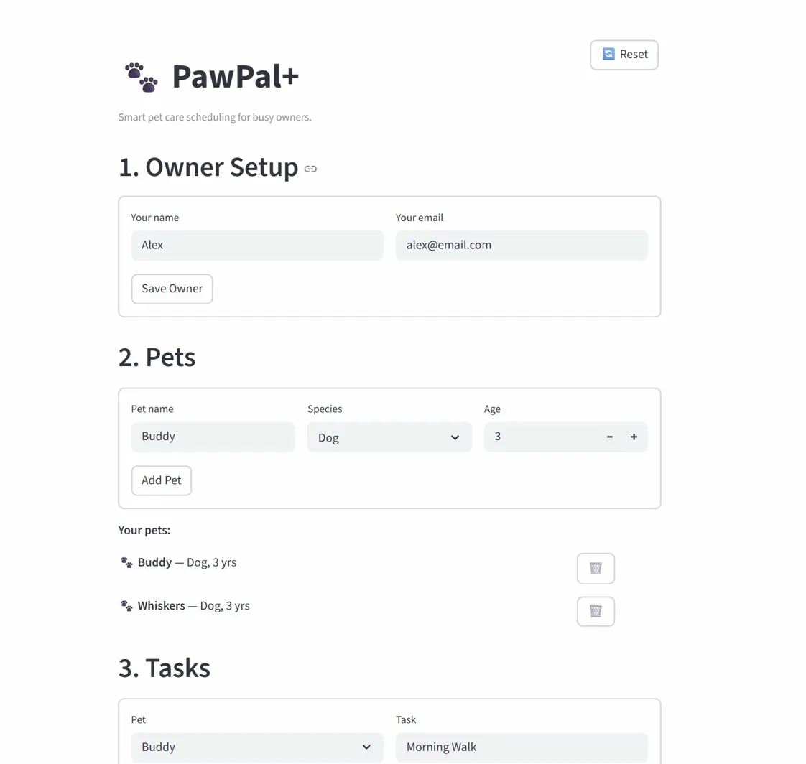

# 🐾 PawPal+

A smart pet care scheduling app built with Python and Streamlit. PawPal+ helps pet owners manage daily routines — feedings, walks, medications, and appointments — using object-oriented design and algorithmic scheduling logic.

---

## 📸 Demo

<a href="screenshot1.png" target="_blank">
  
</a>

<a href="screenshot2.png" target="_blank">
  
</a>

---

## ✨ Features

- **Add owners and multiple pets** with a clean Streamlit UI
- **Schedule tasks** with time, frequency (once/daily/weekly), and pet assignment
- **Sorting by time** — today's schedule is always shown in chronological order
- **Conflict warnings** — detects when two tasks are scheduled at the same time
- **Recurring tasks** — daily/weekly tasks automatically reschedule on completion
- **Filtering** — view tasks by pet name or completion status
- **Mark complete** — marks tasks done and creates the next recurrence instantly

---

## 🧠 Smarter Scheduling

The `Scheduler` class provides algorithmic intelligence beyond basic task storage:

- `sort_by_time()` uses Python's `sorted()` with a lambda key on `"HH:MM"` strings
- `detect_conflicts()` scans all tasks for duplicate time slots and returns human-readable warnings
- `mark_task_complete()` uses `timedelta` to auto-generate the next occurrence for daily/weekly tasks
- `filter_by_pet()` and `filter_by_status()` allow targeted views of the schedule

---

## 🗂️ Project Structure

```
pawpal-plus/
├── pawpal_system.py   # Core logic: Task, Pet, Owner, Scheduler classes
├── app.py             # Streamlit UI
├── main.py            # CLI demo script for backend verification
├── tests/
│   └── test_pawpal.py # Automated pytest suite
├── uml_final.png      # Final UML class diagram
├── reflection.md      # Design and AI collaboration reflection
└── requirements.txt
```

---

## 🧪 Testing PawPal+

Run the full test suite with:

```bash
python -m pytest tests/ -v
```

**Tests cover:**
- `mark_complete()` correctly sets task status to `True`
- Adding a task increases a pet's task count
- Sorting returns tasks in chronological order
- Daily tasks create a recurrence for the next day
- One-time tasks produce no recurrence
- Conflict detection flags duplicate time slots
- No false positives when all task times are unique

**Confidence level: ⭐⭐⭐⭐⭐** — All 7 tests pass consistently.

---

## 🚀 Getting Started

```bash
python -m venv .venv
source .venv/bin/activate       # Windows: .venv\Scripts\activate
pip install -r requirements.txt
streamlit run app.py
```

To run the CLI demo:
```bash
python main.py
```